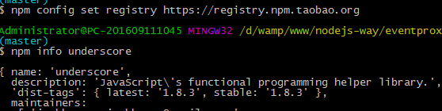
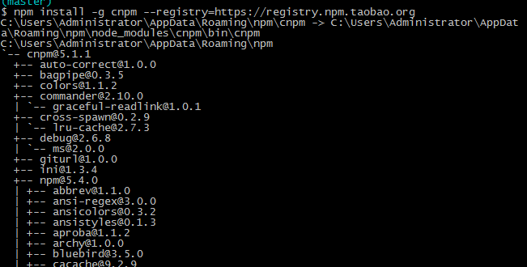
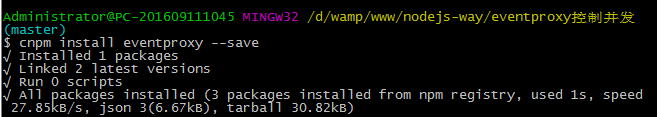

## npm 安装依赖报错解决方案


#### 1.修改安装源

```
npm config set registry https://registry.npm.taobao.org
npm info underscore (配置成功会有很多提示信息)
```

提示信息：




#### 2.安装cnpm 命令替代npm

```
npm install -g cnpm --registry=https://registry.npm.taobao.org
```

成功后信息提示




#### 3.使用 cnpm 命令安装依赖

```
cnpm install eventproxy --save
```

会有如下信息提示



